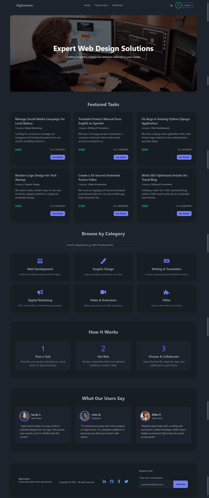
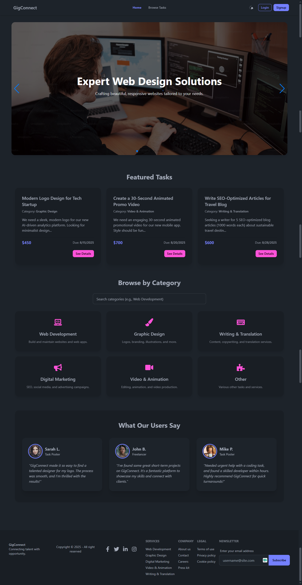

# GigConnect - Client Application

Welcome to the client-side of GigConnect! This application provides the user interface for a freelance task marketplace, enabling users to post tasks, find work, and connect with skilled professionals. It's built with modern web technologies like React, Vite, TailwindCSS, and DaisyUI.

**Live Site URL:** 
https://gig-connect-012-upgraded.web.app


<!--  -->

## Features

*   **User Authentication:** Secure sign-up and login using Email/Password and Google Sign-In.
*   **Task Management (CRUD):** Users can create, read, update, and delete tasks they've posted.
*   **Task Browsing & Details:** A comprehensive page to browse all available tasks with a detailed view for each.
*   **Bidding System:** Freelancers can place bids on tasks, and task creators can view these bids.
*   **Dynamic Home Page:** Features an engaging banner, a section for featured tasks (closest deadlines first), category browsing, and user testimonials.
*   **Responsive Design:** Adapts to various screen sizes (mobile, tablet, desktop) for a seamless user experience.
*   **Dark/Light Theme Toggle:** Users can switch between dark and light themes for visual comfort.
*   **Interactive UI:** Enhanced with scroll-reveal animations and user-friendly notifications.
*   **Protected Routes:** Ensures that certain pages (like "Add Task", "My Posted Tasks") are accessible only to logged-in users.
*   **404 Error Page:** A custom page for handling non-existent routes.

## Tech Stack

*   **Framework/Library:** React
*   **Build Tool:** Vite
*   **Routing:** React Router DOM
*   **Styling:** Tailwind CSS & DaisyUI
*   **State Management:** React Context API (for Auth)
*   **Form Handling:** React Hook Form
*   **Notifications:** SweetAlert2
*   **Carousel/Slider:** SwiperJS
*   **Scroll Animations:** React Awesome Reveal
*   **Authentication Backend:** Firebase Authentication
*   **Deployment:** Firebase Hosting

## Getting Started

### Prerequisites

*   Node.js (v22.15.1 or later recommended)
*   npm (v10.9.2 or later)
*   Firebase CLI (for deployment): `npm install -g firebase-tools`

### Project Setup

1.  **Clone the repository:**
    ```bash
    git clone <your-repository-url>
    cd gig-connect-client
    ```

2.  **Install dependencies:**
    ```bash
    npm install
    # or
    yarn install
    ```

3.  **Set up environment variables:**
    Create a `.env` file in the root of the `gig-connect-client` directory and add the necessary environment variables. At a minimum, you'll need to configure the connection to your backend API:
    ```env
    VITE_API_BASE_URL=http://localhost:5000/api/v1 # Or your deployed backend URL
    ```
    You will also need to configure your Firebase project credentials for client-side Firebase SDK initialization. These are typically stored in a Firebase configuration object within your application code (e.g., in a `firebase.config.js` file that is imported) and are safe to include in client-side code.

### Running the Project (Development)

To start the development server:
```bash
npm run dev

```
The application will typically be available at `http://localhost:5173`.

### Deployment

This project is configured for deployment using Firebase Hosting.

1.  **Build the project for production:**
    ```bash
    npm run build
    
    ```
    This will create a `dist` folder with the optimized static assets.

2.  **Deploy to Firebase:**
    Ensure you are logged into Firebase (`firebase login`) and have initialized Firebase in your project (`firebase init hosting` if you haven't already, selecting the `dist` directory as your public directory).
    ```bash
    firebase deploy --only hosting
    ```


